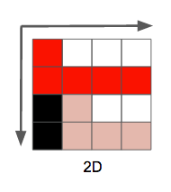
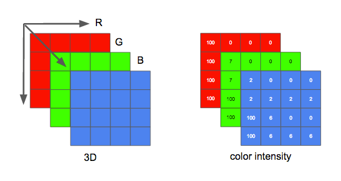

# 理解图像

## 基础知识

一个**图像**可以视作一个**二维矩阵**。我们把这个矩阵里的每一个点称为**像素**（图像元素）。



### 颜色模型

#### RGB

如果将**色彩**考虑进来，我们可以继续扩展：将这个图像视作一个**三维矩阵**——多出来的维度用于储存色彩信息。

如果我们选择三原色（红、绿、蓝）代表这些色彩，这就定义了三个平面：第一个是红色平面，第二个是绿色平面，最后一个是蓝色平面。



像素的色彩由三原色的**强度**（通常用数值表示）表示。例如，一个**红色像素**是指强度为 0 的绿色，强度为 0 的蓝色和强度最大的红色。**粉色像素**可以通过三种颜色的组合表示。如果规定强度的取值范围是 0 到 255，**红色 255、绿色 192、蓝色 203** 则表示粉色。

例如以下几张图片。第一张包含所有颜色平面，剩下的分别是红、绿、蓝色平面（显示为灰调。颜色强度高的地方显示为亮色，强度低为暗色。


我们可以看到，对于最终的成像，红色平面对强度的贡献更多（三个平面最亮的是红色平面），蓝色平面（最后一张图片）的贡献大多只在马里奥的眼睛和他衣服的一部分。所有颜色平面对马里奥的胡子（最暗的部分）均贡献较少。

存储颜色的强度，需要占用一定大小的数据空间，这个大小被称为**颜色深度**。假如每个颜色（平面）的强度占用 8 bit（取值范围为 0 到 255），那么颜色深度就是 24（8*3）bit，我们还可以推导出我们可以使用 2 的 24 次方种不同的颜色。

#### YUV

与 RGB 不同，YUV（或Y'UV）颜色模型基于人类如何感知彩色图像。它将亮度（光亮）和色度（颜色）分离开，这里讲解其中一种分离模型 —— **YCbCr**<sup>*</sup>。

> <sup>*</sup> 有很多种模型做同样的分离。

这个颜色模型使用 **Y** 来表示亮度，还有两种颜色通道：Cb（蓝色色度） 和 Cr（红色色度）。YCbCr 可以由 RGB 转换得来，也可以转换回 RGB。使用这个模型我们可以创建拥有完整色彩的图像，如下图。


##### YCbCr 和 RGB 之间的转换

有人可能会问，在**不使用绿色（色度）**的情况下，我们如何表现出所有的色彩？

为了回答这个问题，我们将介绍从 RGB 到 YCbCr 的转换。我们将使用 [ITU-R 小组](https://en.wikipedia.org/wiki/ITU-R)*建议的[标准 BT.601](https://en.wikipedia.org/wiki/Rec._601) 中的系数。

第一步是计算亮度，我们将使用 ITU 建议的常量，并替换 RGB 值。

```
Y = 0.299R + 0.587G + 0.114B
```

一旦我们有了亮度后，我们就可以拆分颜色（蓝色色度和红色色度）：

```
Cb = 0.564(B - Y)
Cr = 0.713(R - Y)
```

并且我们也可以使用 YCbCr 转换回来，甚至得到绿色。

```
R = Y + 1.402Cr
B = Y + 1.772Cb
G = Y - 0.344Cb - 0.714Cr
```
通常，**显示屏**（监视器，电视机，屏幕等等）**仅使用 RGB 模型**，并以不同的方式来组织，看看下面这些放大效果：


> 还有许多其它模型也可以用来表示色彩，进而组成图像。例如，给每种颜色都标上序号（如下图），这样每个像素仅需一个字节就可以表示出来，而不是 RGB 模型通常所需的 3 个。在这样一个模型里我们可以用一个二维矩阵来代替三维矩阵去表示我们的色彩，这将节省存储空间，但色彩的数量将会受限。
>
> 

### 分辨率

图片的另一个属性是**分辨率**，即一个平面内像素的数量。通常表示成宽*高，例如下面这张 **4x4** 的图片。


### 宽高比

图像还有一个属性是宽高比，它简单地描述了图像或像素的宽度和高度之间的比例关系。

当人们说这个电影或照片是 16:9 时，通常是指显示宽高比（DAR），然而我们也可以有不同形状的单个像素，我们称为像素宽高比（PAR）。


> 虽然 DVD 的实际分辨率是 704x480，但它依然保持 4:3 的宽高比，因为它有一个 10:11（704x10／480x11）的 PAR。

## 文件类型

### 文件格式

_WIP_

### 常见文件格式

<table>
 <thead>
  <tr>
   <th>缩写</th>
   <th>文件格式</th>
   <th>MIME 类型</th>
   <th>文件拓展名</th>
   <th>浏览器兼容性</th>
  </tr>
 </thead>
 <tbody>
  <tr>
   <th><a>APNG</a></th>
   <th>Animated Portable Network Graphics<br>
    <strong>动态便携式网络图像</strong></th>
   <td><code>image/apng</code></td>
   <td><code>.apng</code></td>
   <td>Chrome, Edge, Firefox, Opera, Safari</td>
  </tr>
  <tr>
   <th><a>AVIF</a></th>
   <th>AV1 Image File Format<br>
    AV1&nbsp;图像文件格式</th>
   <td><code>image/</code>avif</td>
   <td><code>.</code>avif</td>
   <td>Chrome, Opera, Firefox (feature flag)</td>
  </tr>
  <tr>
   <th><a>BMP</a></th>
   <th>Bitmap file<br>
    <strong>位图</strong>文件</th>
   <td><code>image/bmp</code></td>
   <td><code>.bmp</code></td>
   <td>Chrome, Edge, Firefox, Internet Explorer, Opera, Safari</td>
  </tr>
  <tr>
   <th><a>GIF</a></th>
   <th>Graphics Interchange Format<br>
    图像互换格式</th>
   <td><code>image/gif</code></td>
   <td><code>.gif</code></td>
   <td>Chrome, Edge, Firefox, Internet Explorer, Opera, Safari</td>
  </tr>
  <tr>
   <th><a>ICO</a></th>
   <th>Microsoft Icon<br>
    微软图标</th>
   <td><code>image/x-icon</code></td>
   <td><code>.ico</code>, <code>.cur</code></td>
   <td>Chrome, Edge, Firefox, Internet Explorer, Opera, Safari</td>
  </tr>
  <tr>
   <th><a>JPEG</a></th>
   <th>Joint Photographic Expert Group image<br>
    联合影像专家小组图像</th>
   <td><code>image/jpeg</code></td>
   <td><code>.jpg</code>, <code>.jpeg</code>, <code>.jfif</code>, <code>.pjpeg</code>, <code>.pjp</code></td>
   <td>Chrome, Edge, Firefox, Internet Explorer, Opera, Safari</td>
  </tr>
  <tr>
   <th><a>PNG</a></th>
   <th>Portable Network Graphics<br>
    <strong>便携式网络图像</strong></th>
   <td><code>image/png</code></td>
   <td><code>.png</code></td>
   <td>Chrome, Edge, Firefox, Internet Explorer, Opera, Safari</td>
  </tr>
  <tr>
   <th><a>SVG</a></th>
   <th>Scalable Vector Graphics<br>
    <strong>可缩放矢量图形</strong></th>
   <td><code>image/svg+xml</code></td>
   <td><code>.svg</code></td>
   <td>Chrome, Edge, Firefox, Internet Explorer, Opera, Safari</td>
  </tr>
  <tr>
   <th><a>TIFF</a></th>
   <th>Tagged Image File Format<br>
    标签图像文件格式</th>
   <td><code>image/tiff</code></td>
   <td><code>.tif</code>, <code>.tiff</code></td>
   <td>Safari</td>
  </tr>
  <tr>
   <th><a>WebP</a></th>
   <th>Web Picture format<br>
    万维网图像格式</th>
   <td><code>image/webp</code></td>
   <td><code>.webp</code></td>
   <td>Chrome, Edge, Firefox, Opera, Safari</td>
  </tr>
 </tbody>
</table>

### 选择合适的图像格式

_WIP_

### 提供备用图像

_WIP_

## 参考资料

- [图像文件类型与格式指南](https://developer.mozilla.org/zh-CN/docs/Web/Media/Formats/Image_types)
- [编码颜色](https://developer.mozilla.org/en-US/docs/Web/Media/Formats/Video_concepts#encoding_color)